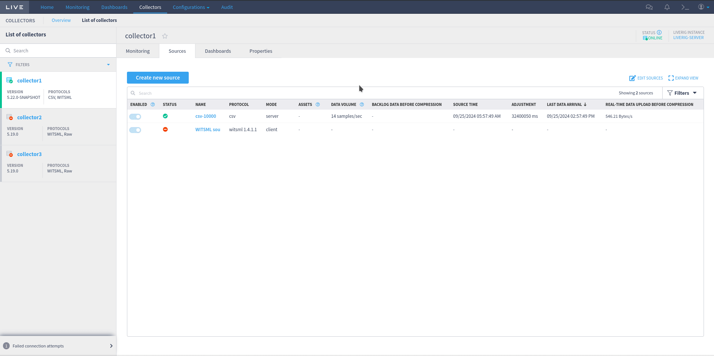
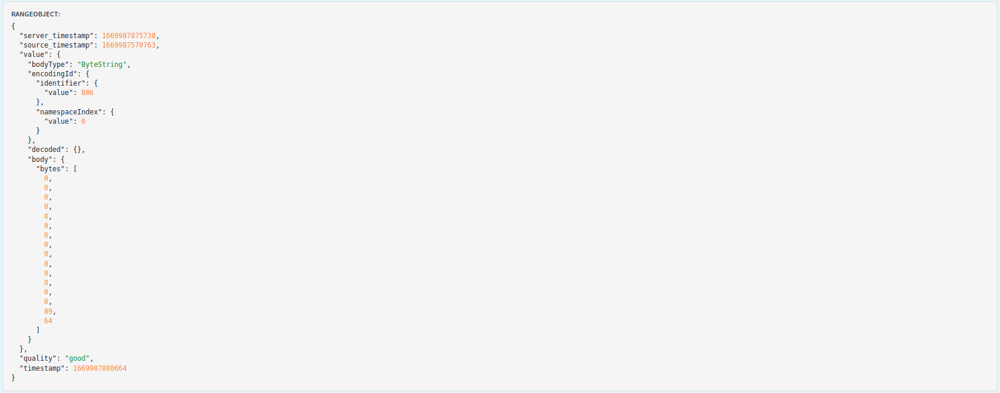

The `store.json` file is used by LiveRig Collector to enrich some kinds of  basic source data streams configured at `sources.xml`.

In LiveRig Collector, two basic source data streams accept unit enrichment and exposure as WITSML, they are: CSV and OPC. 

## CSV data stream

To configure a simple CSV to WITSML log converter

_**Simple example configuration in store.json file for CSV to WITSML log converter**_

```json
{
  "database": {
    "url": "jdbc:postgresql://postgres:5432/?user=postgres&password=postgres",
    "parameters": {
      "timescale": false,
      "timescale.chunk_interval": 604800000,
      "timescale.compress_after": 3600000
    }
  },
  "endpoint": "http://0.0.0.0:1234/witsml/store",
  "limit": 1234,
  "purge": "300000",
  "rigs": {
    "10000": {
      "name": "10000",
      "timestamp": "TIME",
      "tags": {
        "CHANNEL 1": "CHANNEL 1",
        "CHANNEL 2": "CHANNEL 2",
        "CHANNEL 3": "CHANNEL 3",
        "CHANNEL 4": "CHANNEL 4",
        "CHANNEL 5": "CHANNEL 5",
        "CHANNEL 6": "CHANNEL 6",
        "CHANNEL 7": "CHANNEL 7",
        "CHANNEL 8": "CHANNEL 8",
        "CHANNEL 9": "CHANNEL 9",
        "CHANNEL 10": "CHANNEL 10"
      },
      "units": {
        "CHANNEL 1": "m",
        "CHANNEL 2": "cm",
        "CHANNEL 3": "mm",
        "CHANNEL 4": "dm",
        "CHANNEL 5": "V",
        "CHANNEL 6": "mV",
        "CHANNEL 7": "A",
        "CHANNEL 8": "mA",
        "CHANNEL 9": "ohm",
        "CHANNEL 10": "°C"
      },
      "types": {
        "CHANNEL 1": "string",
        "CHANNEL 2": "string",
        "CHANNEL 3": "string",
        "CHANNEL 4": "string",
        "CHANNEL 5": "string",
        "CHANNEL 6": "string",
        "CHANNEL 7": "string",
        "CHANNEL 8": "string",
        "CHANNEL 9": "string",
        "CHANNEL 10": "string"
      }
    }
  }
}
```

| Name      | Description                        | Required                             | Default value |
| --------- | ---------------------------------- | ------------------------------------ | ------------- |
| name      | An identifier for this rig         | **yes**                              |               |
| timestamp | A timestamp field identifier       | no                                   | TIMESTAMP     |
| tags      | Uses the Tag (logCurveInfo) as a value.  | **yes**                              |               |
| units     | Uses the UOM as a value            | no                                   |               |
| types     | Uses the type as a value           |  yes | string        |

### Database service

In _store.json_ file

```json
{
...

"database": {
    "url": "jdbc:postgresql://localhost:5432/?user=root&password=rootpassword",
    "parameters": {
        "timescale": true,
        "timescale.chunk_interval": 604800000,
        "timescale.compress_after": 3600000
    }
...
}
```

**url**: Database service endpoint

#### **for TimescaleDB enabled**:

**Chunk Interval**: Hypertables in TimescaleDB are automatically partitioned into smaller pieces, called chunks. Each chunk contains a specific amount of data, defined by chunk interval configuration. Behind the scenes, each chunk is the smallest portion of data that can be compressed and decompressed. timescale.chunk_interval setting is expressed in milliseconds, and defaults to 7 days (604800000 ms).

**Compress After**: Represents the amount of time after which the hypertable chunks will be automatically compressed in the background. A recurrent policy is set to compress every chunk containing data older than this configuration. timescale.compress_after setting is also expressed in milliseconds, and defaults to 1 hour (3600000 ms).

### WITSML Store endpoint

```json
{
...

  "endpoint": "http://0.0.0.0:1234/witsml/store",

...
}
```

This field is required to expose WITSML Store Server endpoint

### Limit

```json
{
...

  "limit": 1234,

...
}
```

_limit_ field is not required. Its purpose is to limit the number of values to be returned on a request to the WITSML store. The _default_ value is 1000.


## Purge

```json
{
...

   "purge": "300000",

...
}
```

Purge field is not required field. Its purpose is to set a period to purge old values from the WITSML store (to avoid the collector's disk filling up). This is calculated using the following formula: CURRENT_TIMESTAMP - PURGE_INTERVAL. This interval is used in seconds. Example: If the purge field value is 1000, that means that values older than 1000 seconds from the current time will be deleted. The default state of this feature is off.

### Rigs

```json
...

  "rigs": {
    "10000": {
      "name": "10000",
      "timestamp": "TIME",
      "tags": {
        "CHANNEL 1": "CHANNEL 1",
        "CHANNEL 2": "CHANNEL 2",
        "CHANNEL 3": "CHANNEL 3",
        "CHANNEL 4": "CHANNEL 4",
        "CHANNEL 5": "CHANNEL 5",
        "CHANNEL 6": "CHANNEL 6",
        "CHANNEL 7": "CHANNEL 7",
        "CHANNEL 8": "CHANNEL 8",
        "CHANNEL 9": "CHANNEL 9",
        "CHANNEL 10": "CHANNEL 10"
      },
      "units": {
        "CHANNEL 1": "m",
        "CHANNEL 2": "cm",
        "CHANNEL 3": "mm",
        "CHANNEL 4": "dm",
        "CHANNEL 5": "V",
        "CHANNEL 6": "mV",
        "CHANNEL 7": "A",
        "CHANNEL 8": "mA",
        "CHANNEL 9": "ohm",
        "CHANNEL 10": "°C"
      },
      "types": {
        "CHANNEL 1": "string",
        "CHANNEL 2": "string",
        "CHANNEL 3": "string",
        "CHANNEL 4": "string",
        "CHANNEL 5": "string",
        "CHANNEL 6": "string",
        "CHANNEL 7": "string",
        "CHANNEL 8": "string",
        "CHANNEL 9": "string",
        "CHANNEL 10": "string"
      }
    }

...
```

Where each _rig_ is a client configured in _sources.xml_ and:


#### Name

```json
...
  "rigs": {
     ...
     "name": "10000"
     ....
  }
...
```

is a **required** field for a CSV client name

### Timestamp

```json
...
  "rigs": {
     ...
     "timestamp": "TIME"
     ....
  }
...
```

is an **optional** field _default = TIMESTAMP_

#### Tags

Due to compatibility to [OPC-UA/DA](../remote-control/sources/opc-requests.md) to WITSML converter all CSV columns associated **MUST** start with "CHANNEL \<INCREMENT NUMBER\>"

_Thus_:

Given a CSV with 10 columns configured schema should be something like this

```json
...

  "rigs": {
    "MY_CSV_CLIENT": {

      ...

      "tags": {
        "CHANNEL 1": "CHANNEL 1",
        "CHANNEL 2": "CHANNEL 2",
        "CHANNEL 3": "CHANNEL 3",
        "CHANNEL 4": "CHANNEL 4",
        "CHANNEL 5": "CHANNEL 5",
        "CHANNEL 6": "CHANNEL 6",
        "CHANNEL 7": "CHANNEL 7",
        "CHANNEL 8": "CHANNEL 8",
        "CHANNEL 9": "CHANNEL 9",
        "CHANNEL 10": "CHANNEL 10"
      },
      "units": {
        "CHANNEL 1": "m",
        "CHANNEL 2": "cm",
        "CHANNEL 3": "mm",
        "CHANNEL 4": "dm",
        "CHANNEL 5": "V",
        "CHANNEL 6": "mV",
        "CHANNEL 7": "A",
        "CHANNEL 8": "mA",
        "CHANNEL 9": "ohm",
        "CHANNEL 10": "°C"
      },
      "types": {
        "CHANNEL 1": "string",
        "CHANNEL 2": "string",
        "CHANNEL 3": "string",
        "CHANNEL 4": "string",
        "CHANNEL 5": "string",
        "CHANNEL 6": "string",
        "CHANNEL 7": "string",
        "CHANNEL 8": "string",
        "CHANNEL 9": "string",
        "CHANNEL 10": "string"
      }
    }
  }
...
```

#### IMPORTANT

All channel types **MUST** be string. CSV parser only recognizes **string** object.

### Configuring CSV client

More details to configure CSV client to send data to Liverig collector, click [here](../protocols/csv.md)

For _store.json_ file example above _sources.xml_ file should be something like this:  

```xml
<?xml version="1.0" encoding="UTF-8" standalone="yes"?>
<!-- Saved 2024-09-23 15:59:45.164 by Live's user: admin from web interface -->

<sources>
    <source>
        <id>1</id>
        <name>csv-10000</name>
        <enabled>true</enabled>
        <mode>server</mode>
        <rig_name>10000</rig_name>
        <service_company>intelie</service_company>
        <protocol_name>csv;date_format=yyyy-MM-dd'T'hh:mm:ss</protocol_name>
        <endpoint>tcp://0.0.0.0:10000</endpoint>
        <tls_auth>false</tls_auth>
        <requests/>
    </source>
</sources>

```

### Accessing converted CSV to WITSML 1.4.1.1 Log

Go to collectors->collector1->sources and click "Create new source" (See below)


Once created you can use _WITSML browser_ to access WITSML log (see example below)




### Limitations

This CSV to WITSML Log converted has limitation:

- Can only be accessed locally
- Ignores _queryOptions_ queries, i.e. _queryOptions: returnElements=all_


## OPC protocol
The LiveRig Collector depends on the Node Ids (Tags) values, among other information, to query OPC server properly. These values are mapped in the following JSON format, as below:

```json
{
  "database": {
    "url": "jdbc:postgresql://localhost:5432/?user=root&password=rootpassword",
    "parameters": {
      "timescale": false,
      "timescale.chunk_interval": 604800000,
      "timescale.compress_after": 3600000
    }
  },
  "endpoint": "http://127.0.0.1:1234/witsml/store",
  "limit": 1234,
  "purge": "300000",
  "rigs": {
    "NS04": {
      "name": "NS04",
      "timestamp": "TIME",
      "tags": {
        "RandomInt32": "ns=2;s=Dynamic/RandomInt32",
        "RandomInt64": "ns=2;s=Dynamic/RandomInt64"
      },
      "units": {
        "RandomInt32": "m",
        "RandomInt64": "m/s"
      },
      "types": {
        "RandomInt32": "long",
        "RandomInt64": "long"
      }
    }
  }
}
```

Each object under rigs is related to an **OPC-DA** or **OPC-UA** source, linking the `store.json` and `sources.xml` files through their **Rig Name**. 

Some extra fields are responsible for an additional collector feature known as [OPC to WITSML protocol conversion](./../protocol-conversion.md). These optional fields are: `database`, `endpoint`, `limit` and `purge`. Once the `endpoint` and `database` are configured, a basic WITSML server will start backed by a PostgreSQL database to keep the data and enable the WITSML queries on top of it.

The `alias` is used as a key reference for tags, units and types values.&#x20;

| Name      | Description                        | Required                             | Default value |
| --------- | ---------------------------------- | ------------------------------------ | ------------- |
| name      | An identifier for this rig         | **yes**                              |               |
| timestamp | A timestamp field identifier       | no                                   | TIMESTAMP     |
| tags      | Uses the Tag (nodeId) as a value.  | **yes**                              |               |
| units     | Uses the UOM as a value            | no                                   |               |
| types     | Uses the type as a value           | no (if OPC to WITSML converter, yes) | double        |

**NOTE**: For **OPC-UA** sources, the tag field should be written as the following pattern: `ns=<namespaceindex>;<type>=<value>`

## Complex type and date time tags

Since LiveRig Collector version 5.0.0, it can be configured to extract field from object values in **OPC-UA** sources. 

**Example 1:**


In this event, the OPC-UA source returned a value structured as an object with the following format:

```json
{
  "utcTime": 133144611706210000
}
```

To extract the field `utcTime` as the value itself we need to configure the tag using the `?field=` parameter. Example:
`{tag}?field={path}`.

So, in this example the previous tag `"ns=2;s=HelloWorld/ScalarTypes/UtcTime"` would be changed to `"ns=2;s=HelloWorld/ScalarTypes/UtcTime?field=/utcTime"`

Resulting in the following value:


**Example 2:**



In this event, the OPC-UA source returned a value structured as an object with the following format:

```json
{
  "bodyType": "ByteString",
  "encodingId": {
    "identifier": {
      "value": 886
    },
    "namespaceIndex": {
      "value": 0
    }
  },
  "decoded": {},
  "body": {
    "bytes": [0,0,0,0,0,0,0,0,0,0,0,0,0,0,89,64]
  }
}
```
To extract the field `endodingId/indentifier/value` as the value itself we need to configure the tag using the `?field=` parameter. Example:
`{tag}?field={path}`.

So, in this example the previous tag `"ns=2;s=HelloWorld/DataAccess/AnalogValue/0:EURange"` would be changed to `"ns=2;s=HelloWorld/DataAccess/AnalogValue/0:EURange?field=/encodingId/identifier/value"`.
If you want to extract other fields from the same object, you can declare it as a new tag, like `"ns=2;s=HelloWorld/DataAccess/AnalogValue/0:EURange?field=/encodingId/namespaceIndex/value"`
to extract the `encodingId/namespaceIndex/value` as a value.

Resulting in the following value:


**NOTE**: Since the `tags` field from the `store.json` file is a `Map`, you need to add a new alias for each field you want to fetch. Example:
`"RangeObject/Identifier": "ns=2;s=HelloWorld/DataAccess/AnalogValue/0:EURange?field=/encodingId/identifier/value"` and
`"RangeObject/namespaceIndex": "ns=2;s=HelloWorld/DataAccess/AnalogValue/0:EURange?field=/encodingId/namespaceIndex/value"`


 
Instead of manually configuring this file, is also possible to use the remote control page [OPC Requests](./../remote-control/sources/opc-requests.md) to change the settings easily.

